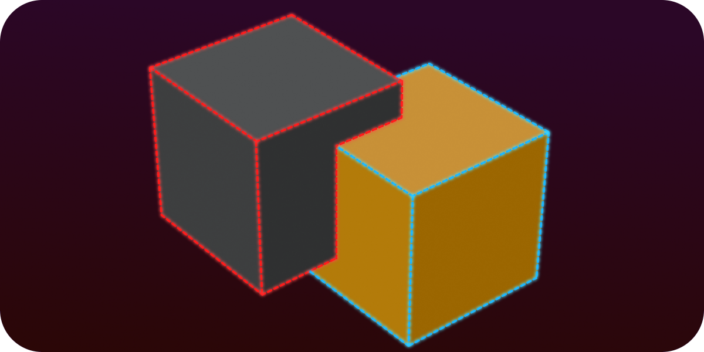
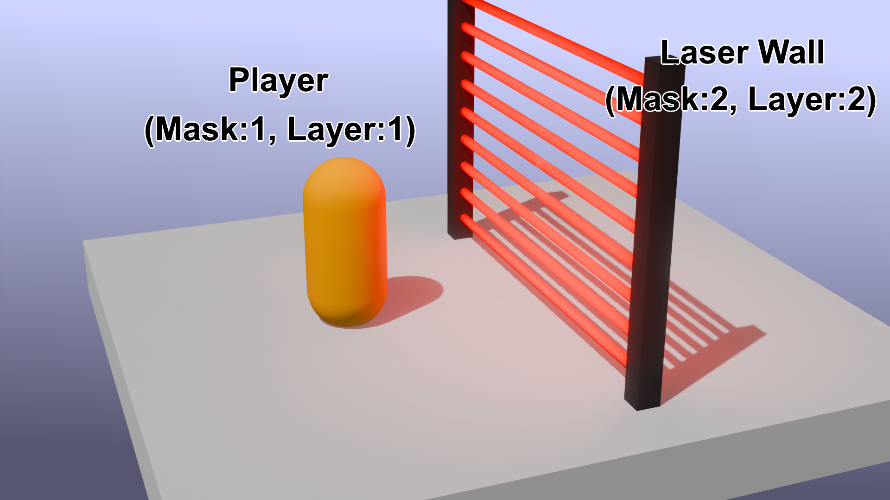
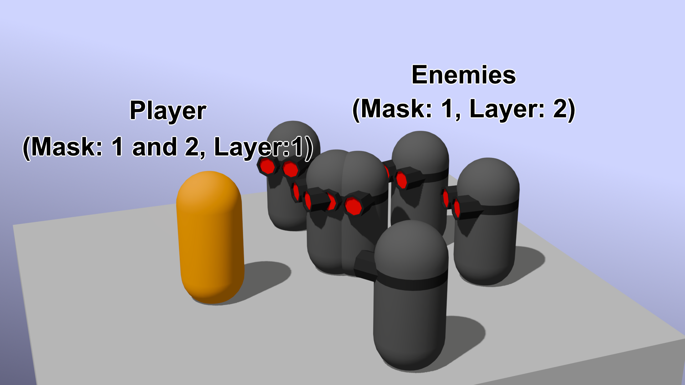
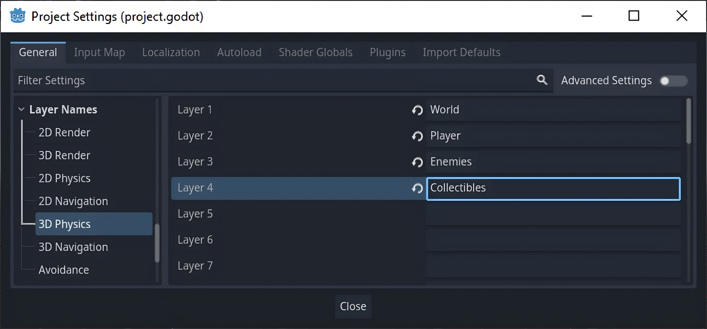
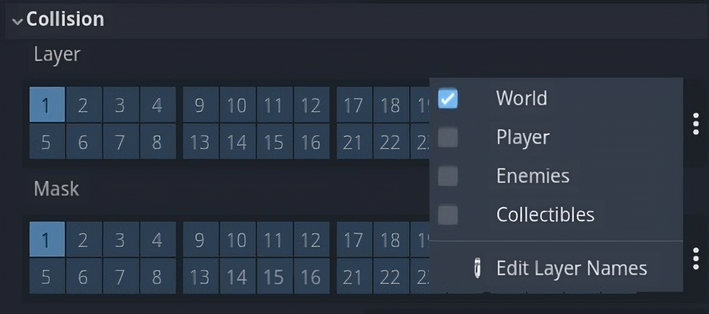

<p align="center" width="100%">
    <h1 align="center"> Introduction  </h1>
</p>

Collision masks and collision layers are an essential part of the Physics engine that handles how objects interact in a space(3D or 2D).
This page will focus on what are collision masks and collision layers and how to work with them in C#.

<p align="center" width="100%">

</p>

## Collision Mask vs Collision Layer
### Collision Layer
Collision layers are the layers which the object **appears** in. <br>
Let’s take a laser wall for example, this wall will ask itself “What objects can collide with me? Who can I stop?”. <br>

### Collision Mask
Collision masks are the layers that the object **scans** for collision. <br>
Let’s take a player collider for example, the collider will ask itself “What can I see? Who can stop me?” <br>
<br>
### Example
1.  If we set the laser wall’s collision layer to 2 and collision mask to 2. <br>
And we set the player’s collision layer to 1 and collision mask to 1. <br>
The player **would** be able to walk through the wall. <br>
<p align="left" width="100%">

</p>

2.  If we set the laser wall’s collision layer to both 1 and 2, <br>
the player **won’t** be able to go through the wall. <br>

3.  If we keep the laser wall’s collision mask to 2 and collision layer to 2. <br>
And set the player’s collision mask to both 1 and 2. <br>
The player **won’t** be able to pass through the wall. <br>
<br>

### Another example:
Let’s say we have enemies in our game. <br>
We set the enemies’ collision layer to 2, and set collision mask to 1. <br>
We set the player’s collision layer to 1, and set collision mask to both 1 and 2. <br>
The enemies would be able to walk through each other, while both the enemies and the player won’t go through each other. <br>
<p align="left" width="100%">

</p>
<br>

## Naming layers
Working with a lot of layer and keeping track of them could get confusing so you might find it useful to assign them a name:
Go to “Project” → “Project Settings” → “Layer Names”.
<p align="left" width="100%">

</p>
<p align="left" width="100%">

</p>
<br>

## How to use in code <br>
Some times we will need to dynamically change the collision detection of objects, luckily there are *multiple* ways for us to do so in Godot C#. <br>

### Calculate layers <br>
First we will need to understand how both masks and layers are programmed. <br>
In code the layers are specified as a bitmask represented by hexadecimal or decimal notation. <br>
(Reading from right to left, each 1 represents an enabled layer, and each 0 represents a disabled one) <br>
In this example layers 1,2 and 4 are enabled: <br>
```cs
uint mask = 0b00000000_00000000_00000000_0001011;
CollisionMask = mask;
```
```cs
	//This can be shortened to:
uint mask = 0b1011;
```
In hexadecimal: <br>
```cs
uint mask = 0x03F3;

	//Can be shortened to:
uint mask = 0x3F3;
```
<br>

### Calculate with Powers of Two: <br>
Every layer is represented with 2 by the power of the layer’s number (layer count starts at 0): <br>
```cs
Layer 1 is 2^0 = 1
Layer 2 is 2^1 = 2
Layer 3 is 2^2 = 4
Layer 4 is 2^3 = 8 
```
If we add **all** the layers together we will get 4294967295 in decimal. <br>
To ignore layers 1,2 and 4:  4294967295 -1 -2 -8 = 4294967284 <br>
```cs
CollisionMask = 4294967284; //This will ignore only layers 1,2 and 4.
```

<br>

### Calculate with Bit Shifting: <br>
To represent all the layers: <br>
```cs
int CollisionLayers = ~0; 
```
(‘~’ is a Bitwise NOT operation, so it inverts the 0 into a 1, enabling all of the layers) <br>
Remove layers with bit shifting (layer count starts at 0): <br>
```cs
~(base_bitmask << layer)

Example:
Layer 1 is ~(1 << 0)
Layer 2 is ~(1 << 1)
Layer 3 is ~(1 << 2)
Layer 4 is ~(1 << 3) 
```
Ignore only layer 2: <br>
```cs
int mask = ~0;
mask = mask & ~(1 << 1);
CollisionMask = (uint)mask; 
```
Ignore only layers 8 and 16: <br>
```cs
int mask = ~0;
mask &= ~((1 << 7) | (1 << 15));
CollisionMask = (uint)mask; 
```
[More about bit shifting](https://learn.microsoft.com/en-us/dotnet/csharp/language-reference/operators/bitwise-and-shift-operators)
